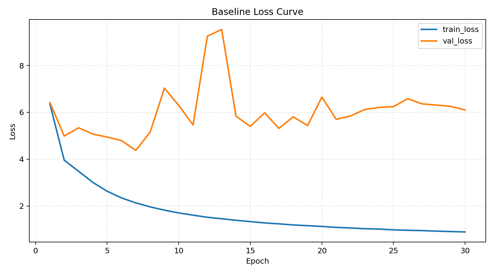
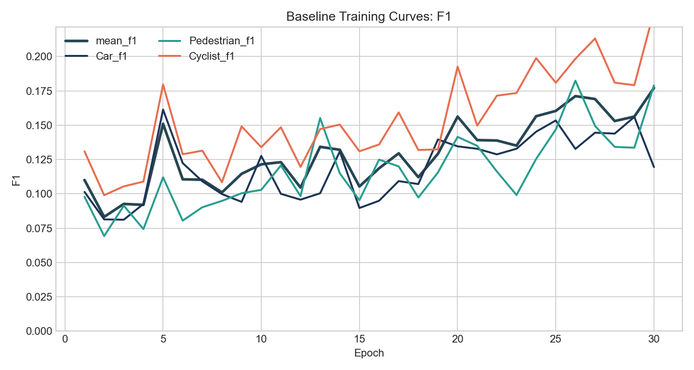
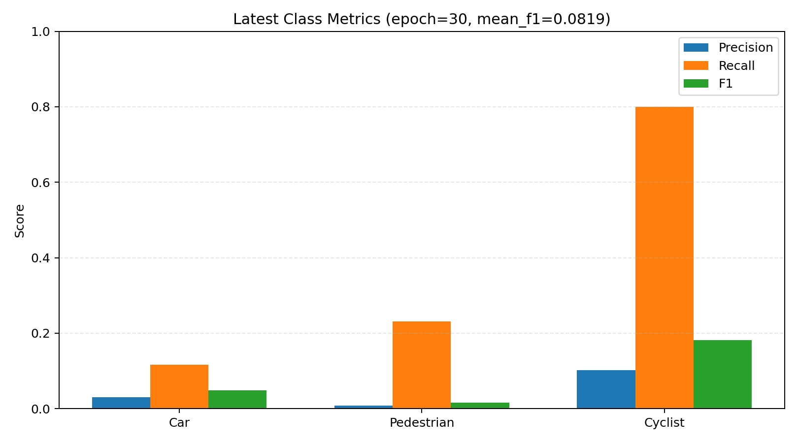
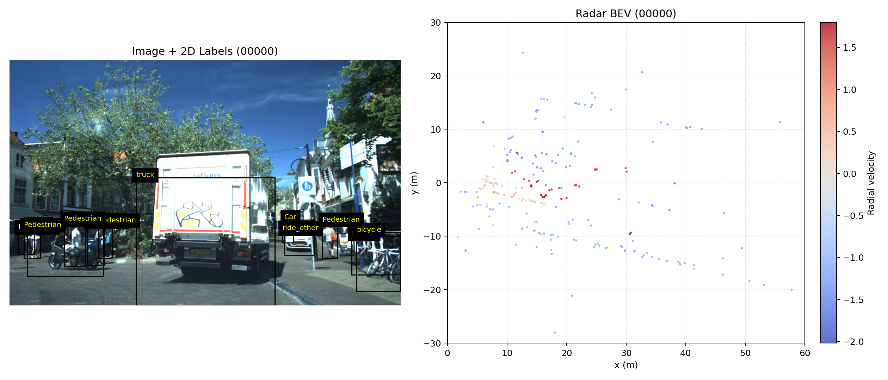

# 4d-radar


-0F8B8D)


本项目用于 4D 毫米波雷达目标检测实验，包含两个独立模块：

- `baseline/`：基线训练与评估
- `visualization/`：可视化网站与序列播放器

## Baseline 网络架构

当前 baseline 是一个可跑通、便于后续消融实验的 **BEV + Center-based 单阶段检测网络**。

- 输入：4D 雷达点云（`point_dim=7`）
- 空间范围：`x:[0,60], y:[-30,30], z:[-6,4]`
- BEV 网格：`voxel_size_xy=[0.25,0.25]`，约 `240x240`
- BEV 7通道特征：
  - `log(1+count)`
  - `z_mean`
  - `rcs_mean`
  - `vr_mean`
  - `rcs_max`
  - `vr_min`
  - `vr_max`
- 主干网络：轻量编码器-解码器 + 跳连融合（U-Net 风格）
- 输出头：
  - `heatmap` 分类头（`Car / Pedestrian / Cyclist`）
  - `reg` 回归头（`dx,dy,z,logl,logw,logh,sin(yaw),cos(yaw)`）
- 损失函数：`Focal(heatmap) + SmoothL1(reg)`，权重 `1:2`
- 评估方式：中心点距离匹配 F1（快速迭代指标，不是官方 3D mAP）

## 相关论文与 GitHub

### 与当前 baseline 技术路线最相关

- CenterNet (Objects as Points)  
  Paper: https://arxiv.org/abs/1904.07850  
  GitHub: https://github.com/xingyizhou/CenterNet

- CenterPoint  
  Paper: https://arxiv.org/abs/2006.11275  
  GitHub: https://github.com/tianweiy/CenterPoint

- PointPillars  
  Paper: https://arxiv.org/abs/1812.05784

- OpenPCDet  
  GitHub: https://github.com/open-mmlab/OpenPCDet

### 4D 雷达方向参考

- RadarPillars (ITSC 2024)  
  DOI: https://doi.org/10.1109/ITSC58415.2024.10919920

- RadarNeXt (2025)  
  Paper: https://arxiv.org/abs/2501.02314

## 数据集来源

- 原始来源：**View-of-Delft (VoD) PUBLIC**
- 本地路径：`E:\毕设\code\vod-min`
- 官方主页：https://intelligent-vehicles.org/datasets/view-of-delft/
- 官方开发工具：https://github.com/tudelft-iv/view-of-delft-dataset

当前本地数据规模：

- `image_2`: 8682
- `radar_5frames/training/velodyne`: 8682
- `calib`: 8682
- `label_2`: 6435
- `ImageSets/train.txt`: 5139
- `ImageSets/val.txt`: 1296
- `ImageSets/train_val.txt`: 6435

## Baseline 最新结果

结果来源：`baseline/outputs/vod_baseline/history.json`（epoch 30）

| 指标 | 数值 |
|---|---:|
| mean_f1 | 0.1771 |
| Car_precision | 0.0675 |
| Car_recall | 0.5205 |
| Car_f1 | 0.1195 |
| Pedestrian_precision | 0.1143 |
| Pedestrian_recall | 0.4121 |
| Pedestrian_f1 | 0.1790 |
| Cyclist_precision | 0.1670 |
| Cyclist_recall | 0.3845 |
| Cyclist_f1 | 0.2329 |

## 结果图

### 训练曲线





### 最新类别指标



### 样例可视化（图像 + 标签 + 雷达 BEV）



## 快速开始

### 训练 baseline

```powershell
cd E:\毕设\code\4d-radar
python -m baseline.train --config baseline/configs/vod_baseline.yaml
```

### 评估 baseline

```powershell
cd E:\毕设\code\4d-radar
python -m baseline.eval --config baseline/configs/vod_baseline.yaml --ckpt baseline/outputs/vod_baseline/best.pt
```

### 启动可视化网站

```powershell
cd E:\毕设\code\4d-radar
python .\visualization\server.py --host 127.0.0.1 --port 8090
```

浏览器访问：`http://127.0.0.1:8090`

