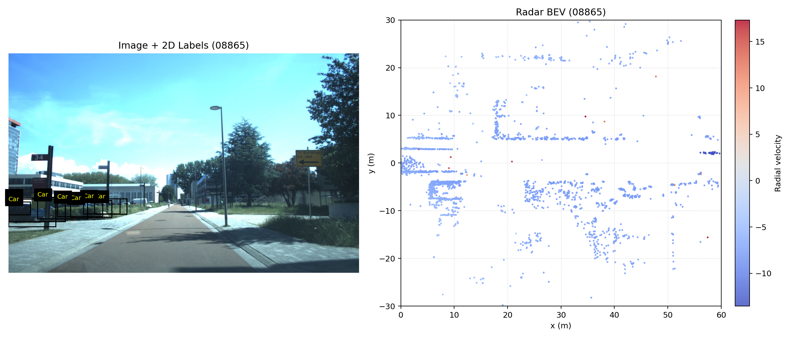
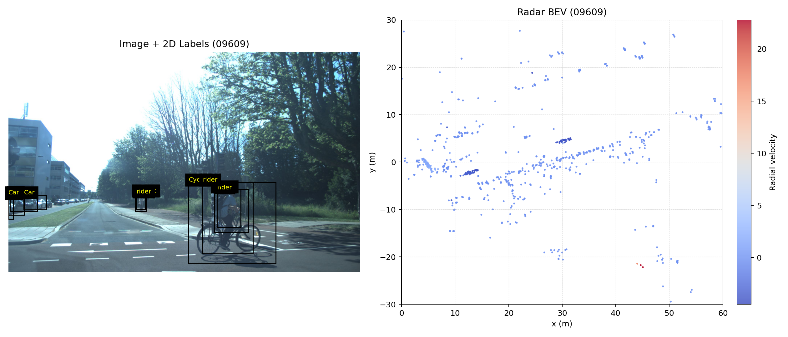
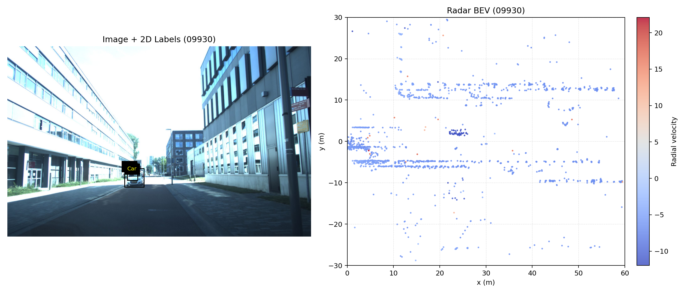

# Baseline 训练集与测试集效果报告

## 1. 实验配置与说明

- 项目目录: `E:\毕设\code\4d-radar\baseline`
- 数据目录: `E:\毕设\code\vod-min`
- 配置文件: `baseline/configs/vod_baseline.yaml`
- 关键设置:
  - `train_split: train`
  - `val_split: test`（训练过程中验证集即测试集）
  - `epochs: 30`
  - `batch_size: 8`
  - `score_thresh: 0.15`
  - `match_center_dist: 2.0`

本报告中的训练集与测试集指标，均基于 `baseline/outputs/vod_baseline/best.pt`（epoch=30）统计。

## 2. 数据划分与数据分布

### 2.1 样本数

| split | 样本数 |
|---|---:|
| train | 5791 |
| test | 644 |
| train_val | 6435 |

### 2.2 目标统计（按当前标签映射与点云范围过滤后）

| split | Car | Pedestrian | Cyclist | 总目标数 | 空样本数 |
|---|---:|---:|---:|---:|---:|
| train | 18572 | 20085 | 48264 | 86921 | 59 |
| test | 1836 | 177 | 2487 | 4500 | 42 |

观察:
- `test` 中 `Pedestrian` 仅 177 个，类别分布明显不均衡。
- `Cyclist` 在 train/test 中都占较高比例，模型更容易学到该类模式。

## 3. 训练过程收敛情况（history.json）

数据来源: `baseline/outputs/vod_baseline/history.json`

### 3.1 损失变化（epoch 1 -> epoch 30）

| 指标 | epoch 1 | epoch 30 | 变化量 | 相对变化 |
|---|---:|---:|---:|---:|
| train loss | 6.3513 | 0.8902 | -5.4610 | -85.98% |
| train heatmap loss | 4.0443 | 0.5006 | -3.5437 | -87.62% |
| train reg loss | 1.1535 | 0.1948 | -0.9587 | -83.11% |
| test loss（训练中 val_loss） | 6.4132 | 6.1051 | -0.3081 | -4.80% |

### 3.2 F1 变化（训练中在 test split 上统计）

| 指标 | epoch 1 | epoch 30 | 变化量 | 相对变化 |
|---|---:|---:|---:|---:|
| Car F1 | 0.0106 | 0.0482 | +0.0376 | +353.98% |
| Pedestrian F1 | 0.0047 | 0.0164 | +0.0117 | +247.90% |
| Cyclist F1 | 0.0758 | 0.1812 | +0.1055 | +139.25% |
| mean F1 | 0.0304 | 0.0819 | +0.0516 | +169.90% |

补充:
- `best mean_f1 epoch = 30`，`best mean_f1 = 0.0819`
- `min val_loss epoch = 7`，但该点并非最优 `mean_f1`，说明“最低损失”与“最佳检测质量”并不完全一致。

## 4. 训练集与测试集最终效果（best.pt）

### 4.1 训练集（全量 5791 帧）

| 类别 | Precision | Recall | F1 |
|---|---:|---:|---:|
| Car | 0.1550 | 0.8229 | 0.2608 |
| Pedestrian | 0.1233 | 0.9795 | 0.2190 |
| Cyclist | 0.1487 | 0.9681 | 0.2578 |
| mean | - | - | 0.2459 |

### 4.2 测试集（全量 644 帧）

| 类别 | Precision | Recall | F1 |
|---|---:|---:|---:|
| Car | 0.0304 | 0.1160 | 0.0482 |
| Pedestrian | 0.0085 | 0.2316 | 0.0164 |
| Cyclist | 0.1022 | 0.7994 | 0.1812 |
| mean | - | - | 0.0819 |

### 4.3 训练/测试差距

| 指标 | train | test | 差值(train-test) | test/train 比例 |
|---|---:|---:|---:|---:|
| mean F1 | 0.2459 | 0.0819 | 0.1639 | 0.3333 |
| Car F1 | 0.2608 | 0.0482 | 0.2127 | 0.1847 |
| Pedestrian F1 | 0.2190 | 0.0164 | 0.2026 | 0.0750 |
| Cyclist F1 | 0.2578 | 0.1812 | 0.0765 | 0.7031 |

结论:
- 存在明显泛化差距（尤其是 `Car`、`Pedestrian`）。
- `Cyclist` 的泛化相对最好（test/train F1 比例最高）。
- 当前阈值设置下整体表现为“高召回、低精度”，误检较多。

## 5. 可视化结果产物

- 目录: `baseline/results/test_vis`
- 已生成图片数: `644`
- 单张图布局: 左侧相机图+标签，右侧雷达 BEV（50% : 50%）

示例:





## 6. 结果解读与后续建议

### 6.1 当前结果的主要特征

- 模型已学到“有目标就报”的能力（召回较高）。
- 对背景抑制不足，导致精度偏低，F1 被拉低。
- `Pedestrian` 在测试集样本偏少，指标波动更敏感。

### 6.2 下一步建议（按优先级）

1. 提高置信度阈值并做阈值扫描（如 `0.15 -> 0.25/0.35/0.45`），优先提升 precision。
2. 增加类别重加权或 focal 参数调节，缓解类别不平衡，重点改善 `Pedestrian`。
3. 引入后处理（简单 NMS/中心点抑制）减少同一区域重复预测。
4. 做系统化消融: 输入通道消融、损失权重消融、`match_center_dist` 消融。
5. 对 `Car/Pedestrian` 失败样本做误差归因（远距离、小目标、遮挡、低点密度）。

## 7. 复现实验命令

```powershell
# 训练（train split）
python -m baseline.train --config baseline/configs/vod_baseline.yaml

# 测试（test split）
python -m baseline.eval --config baseline/configs/vod_baseline.yaml --ckpt baseline/outputs/vod_baseline/best.pt

# 生成 50% image + 50% BEV 可视化
python baseline/scripts/generate_split_visuals.py `
  --data-root ..\vod-min `
  --split test `
  --max-samples 0 `
  --output-dir baseline/results/test_vis
```

